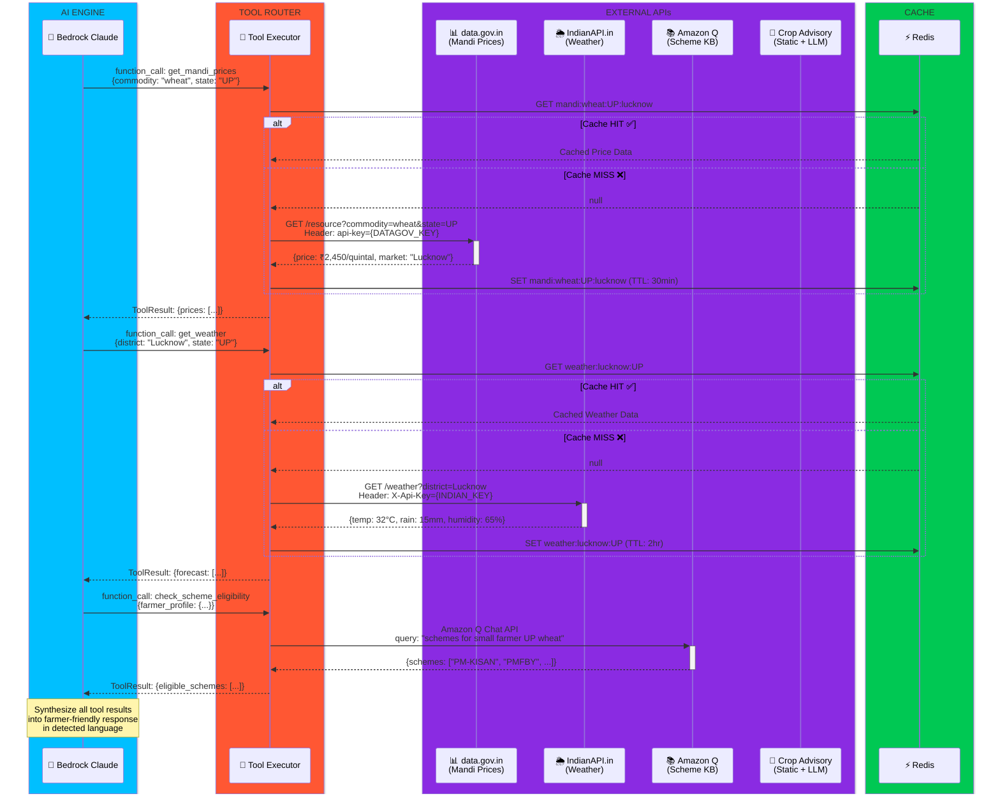
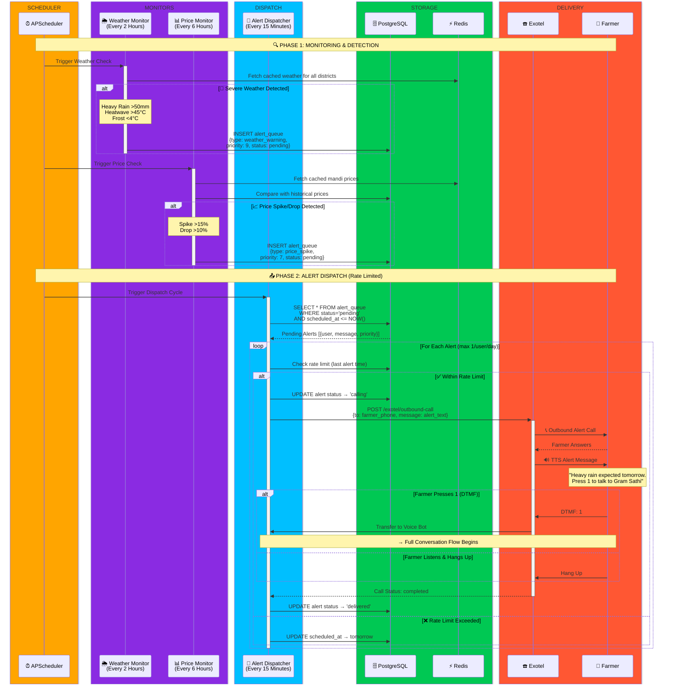
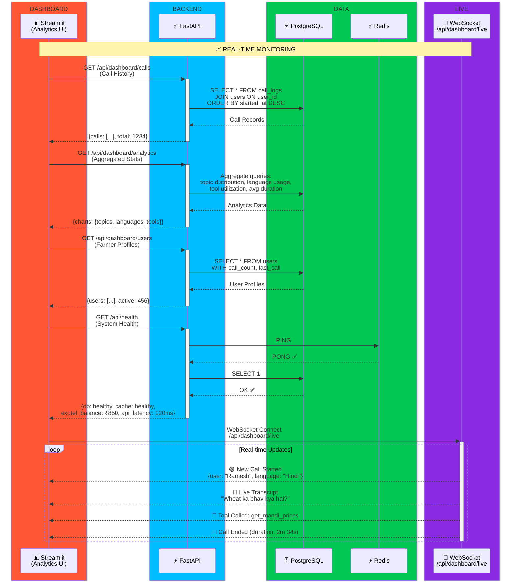
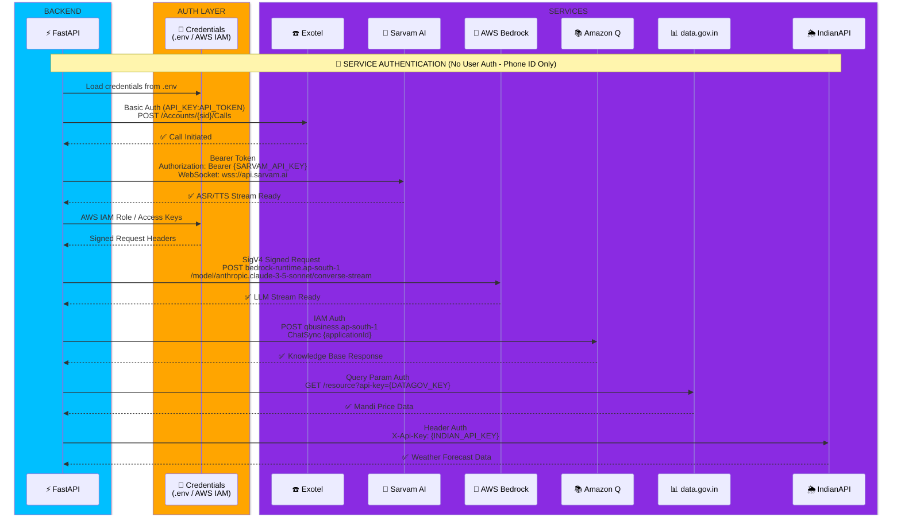

# Gram Sathi - Architecture Sequence Diagrams

## 1. Main Call Flow (End-to-End)

```mermaid
sequenceDiagram
    box rgb(255, 87, 51) FARMER
        participant F as 📱 Farmer<br/>(Feature Phone)
    end
    box rgb(138, 43, 226) TELEPHONY
        participant EX as ☎️ Exotel<br/>(Cloud Telephony)
    end
    box rgb(0, 191, 255) BACKEND
        participant API as ⚡ FastAPI<br/>(App Server)
        participant WS as 🔌 WebSocket<br/>(Voice Channel)
    end
    box rgb(255, 165, 0) VOICE PIPELINE (Pipecat)
        participant ASR as 🎤 Sarvam ASR<br/>(Speech→Text)
        participant LLM as 🧠 Bedrock Claude<br/>(AI Agent)
        participant TTS as 🔊 Sarvam TTS<br/>(Text→Speech)
    end
    box rgb(0, 200, 83) DATA SERVICES
        participant TOOLS as 🔧 Tool Executor
        participant DB as 🗄️ PostgreSQL
        participant RD as ⚡ Redis Cache
    end

    Note over F,RD: 🌾 PHASE 1: MISSED CALL TRIGGER (₹0 for Farmer)

    F->>+EX: ① Missed Call (Dial & Hang Up)
    activate F
    EX->>+API: POST /webhooks/exotel/missed-call<br/>{CallSid, From, Status}
    API->>DB: INSERT call_logs (direction: inbound)
    API->>DB: UPSERT user profile (phone_number)
    API-->>-EX: 200 OK

    Note over API: ⏱️ 5-second delay<br/>(avoid calling during hangup)

    API->>+EX: POST /exotel/callback<br/>(Initiate Outbound Call)
    EX->>F: ② Callback Ring 📞
    F-->>EX: Farmer Answers ✅
    EX-->>-API: Call Connected (status webhook)
    API->>DB: UPDATE call_logs (status: connected)

    Note over F,RD: 🎙️ PHASE 2: VOICE PIPELINE ACTIVATION

    EX->>+WS: WebSocket Connect /ws/voice<br/>(8kHz PCM Audio Stream)
    WS->>DB: LOAD user profile & history
    WS->>RD: LOAD session state

    Note over F,RD: 🗣️ PHASE 3: CONVERSATION LOOP (Repeats per Turn)

    rect rgb(40, 40, 80)
        Note right of F: 🔄 Conversation Turn

        F->>EX: ③ Farmer Speaks (Voice)
        EX->>WS: Audio Frames (base64 PCM JSON)
        WS->>+ASR: Stream Audio Chunks
        ASR-->>-WS: Transcript (auto language detect)

        WS->>DB: INSERT conversation_turns<br/>(turn, transcript, language)

        WS->>+LLM: Send Transcript + Context<br/>(Converse Stream API)

        alt 🔧 Tool Call Required
            LLM->>+TOOLS: Function Call<br/>(tool_name, args)

            par Parallel Tool Execution
                TOOLS->>RD: Check Cache
                RD-->>TOOLS: Cache Miss ❌
                TOOLS->>TOOLS: Call External API<br/>(data.gov.in / IndianAPI / Amazon Q)
                TOOLS->>RD: SET cache (TTL: 30m/2h)
            end

            TOOLS-->>-LLM: Tool Results (JSON)
        end

        LLM-->>-WS: Response Tokens (streaming)

        WS->>+TTS: Stream Text → Speech
        TTS-->>-WS: Audio Chunks (PCM)

        WS->>EX: Audio Response Frames
        EX->>F: ④ Farmer Hears Response 🔊

        WS->>DB: UPDATE conversation_turns<br/>(response, tools_used, latency_ms)
    end

    Note over F,RD: 📴 PHASE 4: CALL END

    F->>EX: ⑤ Farmer Hangs Up
    EX->>WS: Disconnect Event
    deactivate WS
    WS->>DB: UPDATE call_logs<br/>(duration, ended_at, recording_url)
    WS->>RD: CLEANUP session state
    deactivate F
```

## 2. Tool Execution Detail Flow

## 3. Proactive Alert System Flow

## 4. Dashboard & Monitoring Flow

## 5. Authentication & Service Integration

